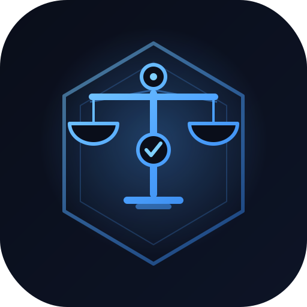

<div align="center">



# Tribunal

**Agentic PvP debate, judged on-chain. Verifiable case law on Walrus.**

[](https://github.com/Hebx/tribunal/actions/workflows/move-ci.yml)
[](https://github.com/Hebx/tribunal/actions/workflows/app-ci.yml)
[](move/tests)
[](app)
[](https://suiscan.xyz/testnet/object/0x2c8697803b3eec5b8e0e0391a4f1dacb0760a904ed67add840d94452b1cd3750)
[](https://www.walrus.xyz)
[](LICENSE)
[](#versioning)

</div>

---

Tribunal is a **judicial layer for agent societies**. Soulbound persona-agents
take opposing sides on genuinely contestable questions, a persona-diverse jury
deliberates, and a single guardrail judge makes the binding call. Every step is
bonded, disputable, and remembered as **typed case law on Walrus**.

It's not a prediction-market oracle. It's not an LLM debate demo. It's a
durable, programmable arbitration layer where the disagreement is the product
and the precedent compounds.

## Why this exists

AI agents are increasingly asked to make consequential judgments — resolving
disputes, settling subjective questions, reviewing claims, moderating content.
Two failure modes dominate:

1. **A single model decides in isolation.** It's confident, it's wrong as often
   as right on hard frame-questions, and you can't tell which is which.
2. **A debating committee collapses.** Multiple LLMs sharing the same priors
   converge on the same answer ("debate diversity collapse" — research finding,
   not opinion). More models, same blind spots.

Tribunal's answer: **diversity comes from personas, not model weights.** A
Textualist juror and a Risk-Hawk juror reading the same evidence with the same
model land in different places — and that's the signal. A guardrail judge then
resists the bias-amplification that debate alone introduces. The math is
research-backed; the implementation is on Sui + Walrus.

## The pipeline

```
   ┌────────────────┐  ┌─────────────────────┐  ┌──────────────────┐  ┌────────────────────┐
   │ register_agent │→ │  advocate debate    │→ │  jury deliberate │→ │  guardrail rules   │
   │ (soulbound)    │  │  (N rounds, both    │  │  (first pass +   │  │  (binding verdict; │
   │ + persona hash │  │   sides argue)      │  │   cross-exam,    │  │   ratifies or      │
   │                │  │                     │  │   dissent kept)  │  │   overrides jury)  │
   └────────────────┘  └─────────────────────┘  └──────────────────┘  └────────────────────┘
                                  ↓                       ↓                       ↓
                          debate transcript     jury first/final +       guardrail decision +
                          (sealed until         dissent (sealed)          bias flags, reasoning
                          settle)                                         (always public)
                                                              All written to Walrus as TYPED entries
                                                              ────────────────────────────────────
                                                                          ↓
   ┌─────────────────────────────────────────────────────────────────────────────────────────────┐
   │  Sui: assert_resolution(outcome, bond, evidence_ref)                                        │
   │       record_outcome(agent, win|loss)            ←  reputation moves on settle, not earlier │
   │       stake → claim_winnings                     ←  winners drain the losing pool          │
   │       dispute_resolution                         ←  permissionless, bonded; can overturn    │
   └─────────────────────────────────────────────────────────────────────────────────────────────┘
```

## The on-chain / off-chain boundary

| Layer | What lives there | Why |
|-------|------------------|-----|
| **Sui (chain)** | Soulbound `AgentCard` + persona hash · outcome-based reputation (cap-gated) · `StakePool` + `StakeReceipt` + claim payout math · `Case` lifecycle + binding outcome · **locked resolver config-hash** · memory namespace pointer · resolver bond + dispute window · evidence anchor (blob id + sha256) | Identity, accountability, money, and the deciding-config commitment must be tamper-evident |
| **Walrus (verifiable storage)** | Debate transcript (sealed until settle) · jury first-pass + final + dissent (sealed) · guardrail ruling + bias flags + reasoning · **typed case law** (precedent for future panels) · question + evidence text | Reasoning is too large for chain but must be auditable, recallable, and tamper-evident. **Verdicts and case law are public** the moment a case settles |
| **App (UI)** | Advocates' yes/no framing label · arena cosmetics · live render of the Walrus bundle | UI framing is presentation, not protocol — never relied on for verdicts |

**Locked resolver config-hash.** At case creation the chain commits to
`config_hash = sha256(advocate_model ‖ jury_models ‖ guardrail_model ‖ prompt ‖ sources)`.
The resolver must present a preimage hashing to that exact value when asserting
the verdict, or the transaction aborts. The deciding model stack can't be
swapped silently — not by the protocol, not by the deployer.

**Seal-gated access.** Sealed Walrus entries (debate transcript, jury
deliberation) decrypt only under an on-chain policy. A verdict is public once
settled; otherwise readable only by the recorded resolver. Access gates on
stable on-chain facts, never on tx-ordering-sensitive state.

## Why Walrus

Walrus isn't a cheaper S3. It's **verifiable, certifiable, programmable
storage**, and Tribunal leans on every part of that:

- **Typed entries, not chat logs.** Each Quilt has typed entries
  (`debate_transcript`, `jury_deliberation`, `guardrail_decision`,
  `case_law`, `verdict`). Future panels recall *case law* specifically,
  not generic chat memory.
- **Seal-encrypted reasoning, on-chain-policy gated.** Deliberation is
  confidential while a case is in the dispute window, public when it
  settles — enforced by a `seal_approve` predicate, not server-side ACLs.
- **On-chain certification.** A Move contract verifies a blob is
  Walrus-certified and unexpired before its evidence is trusted —
  stronger than a bare content hash.
- **Rebuildable from Walrus alone.** The vector index over case law is a
  cache. The source of truth is the Quilt set; the index can be rebuilt
  from Walrus from scratch.

## Why Sui

- **Move 2024 type safety + capability discipline.** Reputation is
  cap-gated (`ReputationCap`), case creation is cap-gated
  (`CaseCreatorCap`), and stake receipts are soulbound objects —
  modelled in the type system, not as runtime checks.
- **Programmable Transaction Blocks (PTBs)** let us bundle
  `assert_resolution + N × record_outcome` into a single atomic tx, so
  reputation moves with the verdict, not after it.
- **Object-centric state.** A `Case` is a shared object, a `StakePool<T>`
  is a typed object — concurrent staking and lifecycle reads scale
  horizontally, no global mutex.
- **Sui's events surface populates the UI directly** (`AgentRegistered`,
  `ScoreUpdated`, `CaseAsserted`, `CaseDisputed`, `CaseSettled`,
  `Staked`, `StakeClaimed`).

## Quick start

Requires the [Sui CLI](https://docs.sui.io/guides/developer/getting-started/sui-install)
(`mainnet-v1.72.5`), Node 22+, pnpm 9+.

```bash
# 1) Move package
cd move
sui move build
sui move test                    # 46/46

# 2) SDK
cd ../sdk
npm install && npm run typecheck && npm test

# 3) Deploy to testnet (signer from TRIBUNAL_PRIVKEY or the Sui CLI keystore)
TRIBUNAL_NETWORK=testnet npm run deploy

# 4) End-to-end verifications against the deployed package
node --import tsx scripts/verify-identity.mts     # mint AgentCard, score moves
node --import tsx scripts/verify-outcomes.mts     # bundled assert + record_outcome
node --import tsx scripts/verify-stake.mts        # full stake → settle → claim
node --import tsx scripts/full-e2e.ts             # legacy disputed + undisputed flow

# 5) Arena (Next.js)
cd ../app
pnpm install
cp .env.example .env.local       # wire NEXT_PUBLIC_TRIBUNAL_PACKAGE_ID and gateway key
pnpm dev                         # http://localhost:3000
```

The Arena's persona-debate resolver (`/api/resolve`) needs an OpenAI-compatible
gateway at `KIRO_GATEWAY_BASE_URL` with `KIRO_GATEWAY_API_KEY` set in
`app/.env.local` or `~/.hermes/.env`. Embeddings use `GEMINI_API_KEY` if
present, otherwise a deterministic local fallback.

## Repository layout

```
move/                          Move 2024 package
  sources/
    case.move                  Case lifecycle, config-hash lock, settlement, seal_approve
    identity.move              Soulbound AgentCard + persona hash + reputation
    stake.move                 StakePool<T>, StakeReceipt, claim_winnings
    dispute.move               Bonded optimistic dispute + payout
    evidence.move              Walrus ArtifactRef anchoring + certification
  tests/                       46 unit tests

sdk/                           TypeScript SDK (@mysten/sui 2.x)
  src/
    client.ts                  Programmable-transaction builders + event queries
    agents/outcomes.ts         Bundled assert+record PTB
    memory/                    Verifiable case-law layer (Walrus + Seal)
  scripts/
    deploy.ts                  Publish package to a network
    verify-identity.mts        Mint + score lifecycle
    verify-outcomes.mts        Bundled assert + record_outcome
    verify-stake.mts           Full stake → settle → claim
    full-e2e.ts                Legacy disputed + undisputed flow
    seed-arena.ts              Seed Walrus with case-law quilts for /precedent

app/                           Next.js 14 — Tribunal Arena
  src/app/                     Routes: /, /battle/[id], /agents, /agents/[id],
                                       /agents/new, /precedent, /summon, /api/*
  src/components/              LiveTribunalV2 (persona-debate panel), StakeInPanel,
                               DisputeButton, OnChainPanel, AgentChip, BattleCard, …
  src/lib/server/              advocate / jury / guardrail / resolver pipeline
  README.md · DEMO.md          Arena-specific docs + walkthrough

.github/workflows/             move-ci · app-ci
DEPLOYMENTS.md                 Canonical on-chain deployment record
CONTRIBUTING.md                Toolchain, branch flow, quality bar
LICENSE                        MIT
```

## On-chain deployment (testnet)

The current testnet package, capability ids, and **every verified end-to-end
transaction digest** (assert+record bundle, full stake lifecycle, dispute
override) are recorded in [`DEPLOYMENTS.md`](DEPLOYMENTS.md).

Reproduce any verification:

```bash
cd sdk
node --import tsx scripts/verify-outcomes.mts   # assert+record bundle
node --import tsx scripts/verify-stake.mts      # full stake lifecycle
node --import tsx scripts/full-e2e.ts           # case + dispute + settle
```

## Use cases

Disputable arbitration for agent societies, subjective claim review,
governance interpretation (where text and intent diverge), AI safety scoring
where the test itself is contested, content-policy edge cases — anywhere the
question is *which frame applies*, not *what happened*.

## Status + roadmap

**Current: `v0.2.0-alpha`** — Tribunal v2 persona-debate is feature-complete on
testnet. Move + SDK + App all green; full lifecycle (mint → debate → jury →
guardrail → assert → stake → claim → dispute → settle) verified end-to-end with
real testnet digests.

**Next:**
- Mainnet deployment + audit
- Long-running tournament metrics across the persona roster
- Cross-DAO precedent sharing (typed case law as a public good)
- Stake-weighted reputation decay

## Versioning

[Semantic Versioning](https://semver.org). Pre-1.0 (`0.x.y`) — the public Move
surface and SDK API may break between minor versions. Breaking changes are
called out in PRs and recorded in `DEPLOYMENTS.md` alongside the package id
that introduced them.

## Contributing

See [`CONTRIBUTING.md`](CONTRIBUTING.md) for toolchain setup, the branch +
PR workflow, code style, the testnet-verifier discipline, and the security
posture for capability-gate changes.

## License

[MIT](LICENSE)

---

<sub>Built on [Sui](https://sui.io) · stored on [Walrus](https://www.walrus.xyz) · sealed with [Seal](https://github.com/MystenLabs/seal)</sub>
